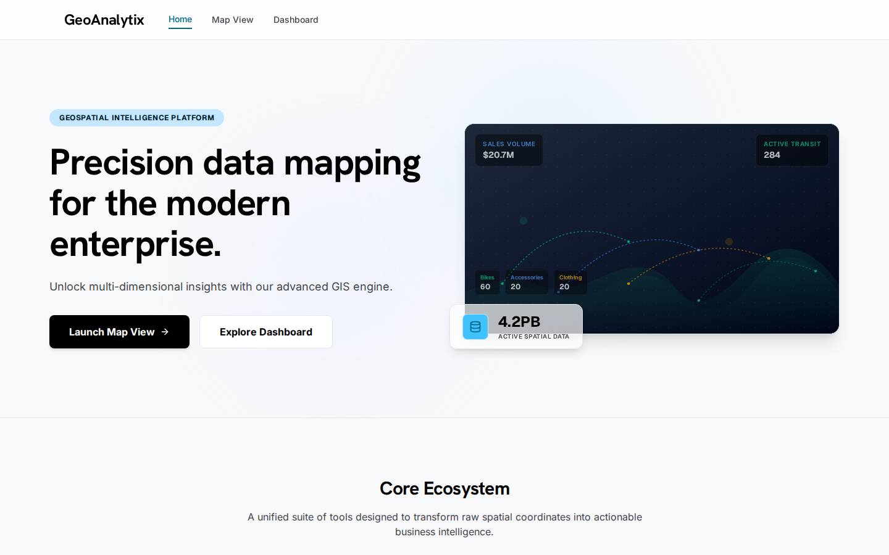
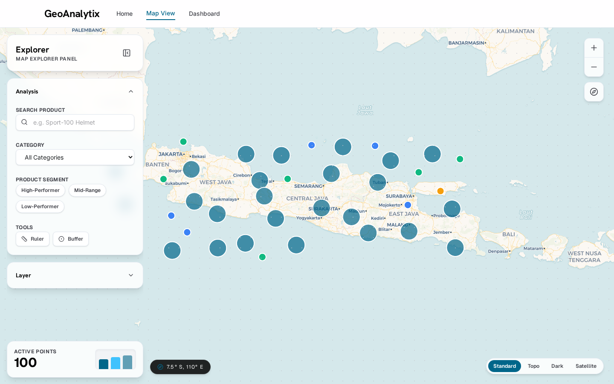
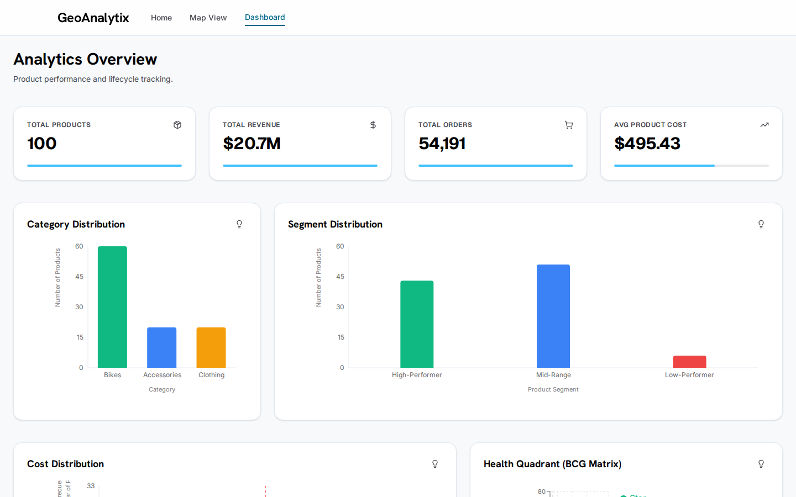
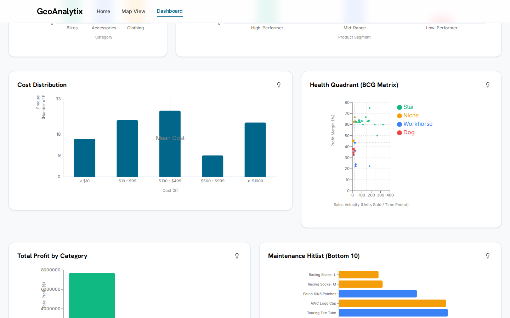

# webgis-store — Product Analytics Dashboard dengan WebGIS

Aplikasi **Product Analytics Dashboard** dengan WebGIS dan Dashboard Analitik. Dibangun menggunakan React (Vite + TypeScript) untuk frontend dan Node.js (Express) untuk backend dengan PostgreSQL + PostGIS.

## Struktur Proyek

```
root/
├── client/          # Frontend React
├── server/          # Backend Express API
├── docs/            # Dokumentasi
│   ├── adr/         # Architectural Decision Records
│   ├── assets/      # Screenshots dan assets
│   └── guide/       # Panduan teknis
└── notebook/        # Eksplorasi data Python
```

## Prerequisites

- Node.js 20+
- PostgreSQL 14+ dengan PostGIS
- npm

## Cara Menjalankan Project

### 1. Server

```bash
cd server
cp .env.example .env.local   # Sesuaikan konfigurasi database
npm install
npm run migrate
npm run dev
```

### 2. Client

```bash
cd client
cp .env.example .env.local   # Sesuaikan VITE_API_URL
npm install
npm run dev
```

Akses client di `http://localhost:3000` dan API di `http://localhost:3001/api`.

### 3. Import Data

Setelah server berjalan, trigger import data:

```bash
curl -X POST http://localhost:3001/api/import
```

### 4. Deployment

- **Server**: Render (Node Native) — set env vars di Dashboard, deploy dari branch `main`
- **Client**: Vercel — set `VITE_API_URL` di Dashboard

## Asumsi yang Digunakan

- Dataset: 100 produk retail yang tersebar di Pulau Jawa
- Sumber data: GeoJSON API eksternal
- Recency merupakan artifact snapshot (~135 hari konstan) — tidak digunakan sebagai indikator independen
- Segmen mengandung ketidakkonsistenan typo pada sumber (`'Mid-Rande'`) → dinormalisasi saat import
- Health score dihitung dari kombinasi recency, time_span, total_orders, dan avg_monthly_revenue
- Produk diklasifikasikan ke quadrant berdasarkan sales_velocity dan profit_margin_pct
- Biaya produk dikelompokkan dalam 3 tier: Low (<$100), Mid ($100–$800), High (>$800)

## Teknologi

| Layer | Teknologi |
|-------|-----------|
| Frontend | React 19, TypeScript, Vite 6, Tailwind CSS 4, MapLibre GL JS, Recharts |
| Backend | Node.js, Express.js, node-postgres, tsx |
| Database | PostgreSQL 14+ with PostGIS |
| Data Source | GeoJSON API eksternal |

## Screenshots

### Home



### Map View



### Dashboard — KPI Overview



### Dashboard — Charts



### Dashboard — Health & Segment


### Dashboard — Map View


## Dokumentasi Tambahan

Lihat folder `docs/` untuk dokumentasi lebih lanjut:
- `docs/problem-framing.md` — Latar belakang, rumusan masalah, dan tujuan proyek
